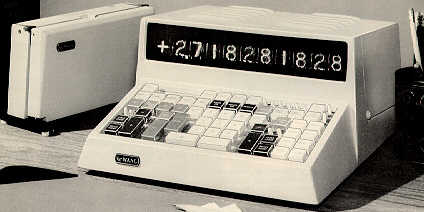
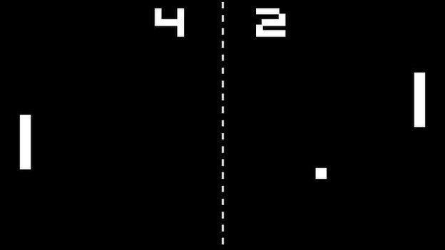
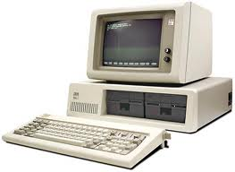

# Here I reminisce a bit as I describe my relationship with computers over the course of my career.

* I am a retired mechanical engineer, having spent a career first at Eastman Kodak for 32 years, then at Corning, Incorporated for 12. When I graduated from Tufts University in 1973, scientific calculators had not come into widespread use. If I needed to do an engineering calculation, I had to either do it on my slide rule or go to the basement of the engineering building and sit down in front of one of the Wang Calculators.

Pong was the video game back then. It was kind of emblematic of the level of power and sophistication of computers of that era.

I only mention these things because I promised to bring you along on my path of discovery.
Computers were *not* part of my background at the beginning of my professional career.
They snuck up on me kind of gradually.
* Before Windows 95 came out, my kids begged me to get a computer with a word processing program. I thought they should have been happy with an electric typewriter. But my neighbor accross the street offered me an IBM-PC that had been decommissioned by his employer.

* I was still reluctant when I actually paid money for my first computer but a friend at IBM offered to get me a Windows 95 computer using his "Friends & Family" discount so I caved.

* But it wasn't until I discovered Hewlett-Packard's 3D CAD software [HP Precision Engineering SolidDesigner (PE/SolidDesigner)](https://www.hpl.hp.com/hpjournal/95oct/oct95a1.pdf) running on unix (HP-UX) that I finally became **enthusiastic** about computers. This was the event that made me realize that I **MUST HAVE** this app. This would enable me to design and build machines on a computer in a way that is not only **painless**, but it was actually **FUN**.

>At the time, Unigraphics was Kodak's "official" CAD system and it was supported by a fairly large IT organization. There were folks in that organization who didn't seem to approve of my choice to use a "maverick" CAD system. And so I needed to spin up on the CAD and the underlying OS enough to provide my own tech support. Fortunately, I was working in Kodak's research labs where we were encouraged to take a week or two of training every year, so I spent my training budget attending courses in SolidDesigner CAD and Unix.

Now that I had **embraced** computers and had become a believer in their usefulness, I got curious about programming languages. I tried to learn C but I never really warmed up to it. I had the same problem with C as I had with Unigraphics. I felt like the tool was making me work too hard on the details. I wanted the tool to take care of the details. I wanted to focus at a higher level. C++ added Object Oriented Prgramming (OOP) to C and that was a big deal at the time. But still, I never quite caught the fever.

It was 2000 when I discovered the **Python Programming language**. Not only was it powerful, but it was **FUN** to use. I wasn't required to do the tedious, boring stuff, like memory allocation and type declaration. Plus, there were tons of libraries available with easily instantiated classes that did all the heavy lifting needed for whatever the task. For example, I only needed to write a couple lines of code in order to get my outdoor lights to turn on at sunset and turn off at bed-time. How cool is that? Now this is Object Oriented Programming that I can get excited about! But I didn't actually do that light control thing until the Raspberry Pi came out. I'm getting ahead of myself.

It was about this time that **Linux** was becoming a household word. Having already learned HP-UX, Linux was like "coming home" for me. I had become a computer hobbyist.

By 2005, things weren't going well for Kodak, so I decided to "jump ship". I retired from Kodak and joined the research division at Corning, Incorporated. In my new job, I got involved with the design of various new mechanical prototypes intended to demonstrate some improved factory process. In addition to the mechanical prototype, I was also able to provide the needed physical computing controls to automate the operation of the aparatus. The standard computer was a Windows 7 machine using a LabJack data acquisition device to interface with the motors and sensors of the apparatus. From here, robots were only a small step away.

It was around 2014 when I discovered the Rapberry Pi. (And the Arduino shortly thereafter) The availabilty of this inexpensive single board computer running Linux opened the floodgates for anyone with an interest in pretty much any aspect of computers. My interest was in physical computing: the interface between computers and the physical apparatus. The Raspberry Pi makes its 40-pin gpio available for connecting to physical devices, making it perfect for physical computing. No more need for the LabJack interface. (Ironically, the cost of the LabJack was roughly equal to the cost of the Paspberry Pi.) Anyway, everything needed for physical computing just keeps getting better, faster and cheaper. The metaphor of "like getting a drink out of a fire-hose" seems pretty accurate.

So there you have it. I retired from Corning in 2017 and moved to Florida, bringing with me a background knowledge in:
* Mechanical Design / Engineering
* Linux OS
* Python
* Raspberry Pi

